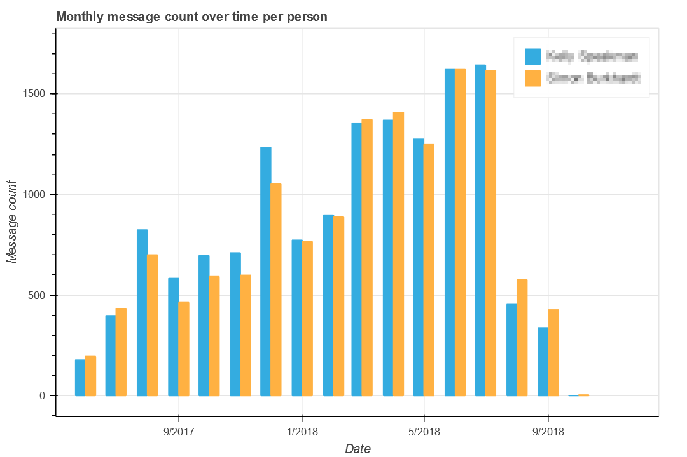
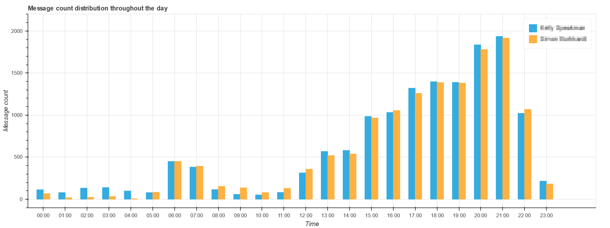

# Telegram Chat Statistics

---

[](https://github.com/auchenberg/volkswagen)

Generate graphs and statistics from your exported Telegram messages.

## Examples






---

## Usage

First you need to export your Telegram data to a `result.json` file. You can do this in the settings of the Telegram desktop client.

```bash
./telegram-statistics.py -i result.json -n "name"
```

### Import Whatsapp

There is a `convert-whatsapp.py` to import a whatsapp exported `Whatsapp Chat with Name.txt` into a Telegram style json format.
To find the correct `[Name Surname]` take the name in the first line in the Whatsapp export txt.
However, the Whatsapp export is not as detailed as the Telegram export, so many numbers cannot be calculated.

```bash
./convert-whatsapp.py -i "Whatsapp Chat with Name.txt"
./telegram-statistics -i whatsapp-result.json -n "Name Surname"
```

Where `"name"` is the name displayed in Telegram (usually the surname).

## Generated Files

The script generates multiple files:

- `emojis.txt` contains unicode encoded emojis and count
- `plot_days_Person A.html` bokeh plot of person A's daily message frequency
- `plot_days_Person B.html` bokeh plot of person B's daily message frequency
- `plot_hours.html` bokeh plot of message frequency over the hours of one day
- `plot_month.html` bokeh plot of message frequency by month
- `plot_weekdays.html` bokeh plot of message frequency over one week
- `raw_metrics.json` raw numerical data (contains all text of both persons / large file)
- `raw_months_person_Person A.csv` csv vaues of month data
- `raw_months_person_Person B.csv` csv vaues of month data
- `raw_weekdays_person_Person A.csv` csv vaues of weekday data
- `raw_weekdays_person_Person B.csv` csv vaues of weekday data

## Metrics

### per chat
- total number of messages
- total number of words
- total number of characters
- count occurrence of each word
- number of unique words

### per person
- total number of messages
- total number of words
- total number of characters
- average number of words per message
- average number of characters per message
- count occurrence of each word
- count occurrence of each emoji
- number of messages formated with markdown
- number of messages of type [animation, audio_file, sticker, video_message, voice_message]
- number of photos
- number of unique words

## Requirements

- `python 3`
- `bokeh`
- `numpy`
- `pandas`

---

## Contributing

I was inspired to do this project by a post on [reddit.com/r/LongDistance](https://www.reddit.com/r/LongDistance/comments/9jud8j/analysis_of_texts_from_a_long_distance/)

I would love to hear if you have made some statistics yourself. Feel free to message me on [reddit](https://www.reddit.com/u/mnemocron)

If you want to implement new metrics feel free to fork and send a pull request.
Here are some things that I think could be improved or added:

- normalize weekly / hourly data to "average number" per day/hour instead of "total number"
- number of edited messages

#### Possible Issues

- csv separator is currently a semicolon `;`
- other country specific errors (eg. with dates)

---

## License

MIT License

Copyright (c) 2018 Simon Burkhardt

